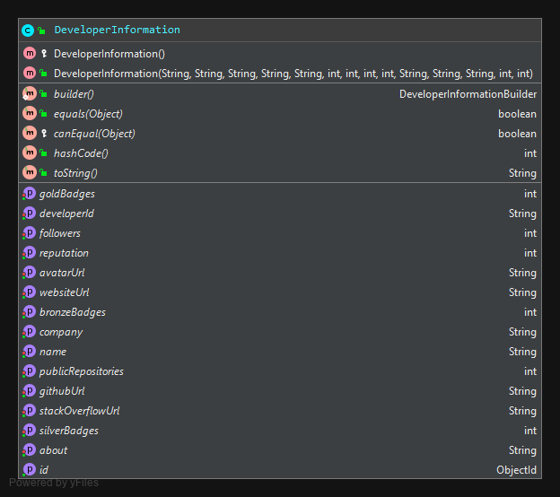

# Developer Informations

## Class Diagram

## Build & Run with Maven
- Datasource:
    - Launch MongoDb in a Docker container with: `docker run --name developer-information-mongodb -p 27018:27017 -e MONGO_INITDB_ROOT_USERNAME=root -e MONGO_INITDB_ROOT_PASSWORD=root mongo:4.2.1`
- Build: `mvn clean install`
- Run: `mvn spring-boot:run -Dspring-boot.run.profiles=local`

## Build & Run with Docker
- Datasource:
    - Launch MongoDb in a Docker container with: `docker run --name developer-information-mongodb -p 27018:27017 -e MONGO_INITDB_ROOT_USERNAME=root -e MONGO_INITDB_ROOT_PASSWORD=root mongo:4.2.1`
- Build: `docker build --tag developer-information:test --rm=true .`
- Run: `docker run -it --name developer-information --publish=8092:8092 developer-information:test`

## Build & Run with Docker Compose
- Build & Run: `docker-compose up --build -d && docker-compose logs -f`
- Stop: `docker-compose down`

## Access
- Actuator: http://localhost:8092/actuator/health
- Swagger: http://localhost:8092/swagger-ui.html
- Database:
    - GUI connector
        - uri: localhost:27018
        - user: root
        - passwrod: root
        - auth: SCRAM-SHA-1
    - Mongo shell
        - `mongo -u root -p root --authenticationDatabase admin localhost:27018`
    
## JDD
- Insert json file:
    - `mongoimport -h localhost:27018 -d developer-information -c developer-information -u root -p root --authenticationDatabase admin --file data-local.json --jsonArray`

