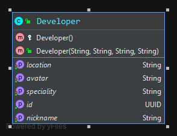

# Microservice Developer


## I. Class Diagram



## II. Run application

### 1. First (easy) possibility: run it with Docker Compose
Launch the application inside a Docker container, based on the following [image](https://hub.docker.com/repository/docker/veben/developer), hosted in Docker hub.
```sh
docker-compose up
```

### 2. Second possibility: run it with Docker
Do the same but with 2 different commands, one for the database container, and one for the service container

#### Datasource:
> Launch PostgreSQL in a Docker container with:
```sh
docker run --name developer-postgresql -p 5433:5432 -e POSTGRES_DB=developer -e POSTGRES_PASSWORD=pass postgres:12-alpine
```

#### Run:
```sh
docker run -it --name developer --publish=8090:8090 veben/developer:latest
```

### 3. Third possibility: run with Docker + Maven Wrapper
Launch the database in a container and the application locally with Maven

### Datasource:
> Launch PostgreSQL in a Docker container with:
```sh
docker run --name developer-postgresql -p 5433:5432 -e POSTGRES_DB=developer -e POSTGRES_PASSWORD=pass postgres:12-alpine
```

#### Build jar:
```sh
mvnw clean install
```

#### Run:
```sh
mvnw spring-boot:run -Dspring-boot.run.profiles=local
```

## III. Access
- Actuator: http://localhost:8090/actuator/health
- Swagger: http://localhost:8090/swagger-ui.html
- Database: jdbc:postgresql://localhost:5433/developer
  - User: postgres
  - Password: pass

## IV. Dataset
### Developer table:
> All data come from Github and Stackoverflow public API

| id                                   | avatar                                                                                           | location       | nickname      | speciality |
| :----------------------------------- | :----------------------------------------------------------------------------------------------- | :------------- | :------------ | :--------- |
| 3bdfbba3-d472-4431-b9ac-c203e7505b8b | https://i.stack.imgur.com/kGFwM.png?s=128&g=1                                                    | France         | veben         | java       |
| 4ca98fd9-927e-40e5-854b-392669f98204 | https://www.gravatar.com/avatar/24780fb6df85a943c7aea0402c843737?s=128&d=developerIdenticon&r=PG | United Kingdom | mjpieters     | python     |
| d15a5fb3-a157-4d13-ad2d-c8add8250e25 | https://www.gravatar.com/avatar/7aa22372b695ed2b26052c340f9097eb?s=128&d=developerIdenticon&r=PG | France         | VonC          | git        |
| 2f91c199-3ab4-4496-9ffa-5ae419b68f49 | https://i.stack.imgur.com/3vbu5.jpg?s=128&g=1                                                    | United Kingdom | mgravell      | c#         |
| 25230b5d-567d-4361-a2dd-03240378648e | https://www.gravatar.com/avatar/1d2d3229ed1961d2bd81853242493247?s=128&d=developerIdenticon&r=PG | United Kingdom | Quentin       | javascript |
| 99f3e575-a935-40ff-8890-9d57752d7694 | https://www.gravatar.com/avatar/dab08478b226280d4a30894c9a7ed719?s=128&d=developerIdenticon&r=PG | India          | anubhava      | regex      |
| 98e85368-fde3-42e1-9079-e9b6ac05df4a | https://www.gravatar.com/avatar/89927e2f4bde24991649b353a37678b9?s=128&d=developerIdenticon&r=PG | Curaçao        | BalusC        | java       |
| 51ef449b-7cd0-4752-86b7-f1362af1d1b9 | https://i.stack.imgur.com/IlnZm.jpg?s=128&g=1                                                    | Austria        | zoechi        | angular    |
| 9b88969f-06da-4cc8-a7b5-840093b9dc9c | https://i.stack.imgur.com/BJXub.png?s=128&g=1                                                    | Belgium        | KommuSoft     | python     |
| d37f2850-9f02-4efc-9e3f-80a0d6a3b7f4 | https://i.stack.imgur.com/wDnd8.png?s=128&g=1                                                    | United States  | CommonsWare   | android    |
| 0338663e-97b8-402f-b15c-55a776a0e22b | https://www.gravatar.com/avatar/2f0d9dec16bae1e06552af55ddefc11f?s=128&d=developerIdenticon&r=PG | France         | jnizet        | java       |
| d69f0549-4c7b-45da-be90-95af26aff311 | https://www.gravatar.com/avatar/6d8ebb117e8d83d74ea95fbdd0f87e13?s=128&d=developerIdenticon&r=PG | United Kingdom | jskeet        | c#         |
| daa00584-0c3a-43fb-85bd-f52eb3e2ffdf | https://www.gravatar.com/avatar/a2d818d801ce38a33807f68fdd92043a?s=128&d=developerIdenticon&r=PG | Singapore      | BoltClock     | css        |
| 9e5145bd-a581-4404-9a79-9a08ebbc903b | https://www.gravatar.com/avatar/cd501083459cbc21fccae78e2d03bee2?s=128&d=developerIdenticon&r=PG | Germany        | Gumbo         | php        |
| 04172846-150b-4b8d-ae7c-92f9b5d78bec | https://i.stack.imgur.com/9ZYta.jpg?s=128&g=1                                                    | Sweden         | pileon        | c++        |
| 7bc177f0-44f4-4eb6-b9a2-54c333daa053 | https://www.gravatar.com/avatar/a8db27c91db97757a829c7971fd62b84?s=128&d=developerIdenticon&r=PG | United Kingdom | hashpling     | git        |
| 653147d1-df71-46df-98d1-034862fda982 | https://i.stack.imgur.com/y8dTt.jpg?s=328&g=1                                                    | Russia         | liaojikunwork | reacjs     |
| 1155ab83-91ef-45ee-9831-6f67ed606c34 | https://i.stack.imgur.com/oJKC8.jpg?s=328&g=1                                                    | Switzerland    | THess         | java       |
| a014cae0-76e3-466d-9707-9965b7d7ae6d | https://avatars1.githubusercontent.com/u/29667012?s=460&v=4                                      | United States  | c_sagan       | python     |
| 1551bfa8-342f-4964-a29f-a211dba0726c | https://www.gravatar.com/avatar/c97e09efbd01ce2633edd27688bc9751?s=328&d=identicon&r=PG          | France         | rrousselGit   | flutter    |
| 0aeb1a4a-71e3-4925-87b2-d0381fe18196 | https://avatars0.githubusercontent.com/u/4053487?s=460&v=4                                       | Germany        | tynn          | android    |
| a6e69705-74b8-427b-a000-7b30c9d79bff | https://i.stack.imgur.com/mfJ7p.jpg?s=328&g=1                                                    | United Kingdom | jagaudin      | python     |
| d5391599-3357-4cb8-a3b7-09cfa38c3fb1 | https://www.gravatar.com/avatar/3f6f1bea81a68b2f1cfe3efbb9be94bc?s=328&d=identicon&r=PG          | United Kingdom | bobince       | javascript |
| 09851df7-e57b-4590-a9ed-2f56ffe4b67b | https://i.stack.imgur.com/EPmGy.jpg?s=328&g=1                                                    | Poland         | Kamilcuk      | c          |
| 6f3286d7-38de-4a53-9632-6fe93e29082e | https://www.gravatar.com/avatar/78cb7314ef6c9ff2954f8e0d6506fc06?s=328&d=identicon&r=PG          | Canada         | Blair Conrad  | python     |
| c5ebd933-25cf-46de-86e4-4714b821b2fd | https://i.stack.imgur.com/rHdZU.png?s=328&g=1                                                    | Spain          | yivi          | php        |
| b2842e6e-d4da-4d2a-8142-1262ff5ca874 | https://i.stack.imgur.com/E9dZn.png?s=328&g=1                                                    | India          | ashwch        | python     |
| 63013409-e4ec-4365-96f5-6c3df348cb24 | https://i.stack.imgur.com/Z13sQ.jpg?s=328&g=1                                                    | India          | khemrajsharma | android    |
| 8f9e4f19-caa9-4077-a839-27b629889782 | https://www.gravatar.com/avatar/8a4d6f03a8879432d8563aefbf48e787?s=328&d=identicon&r=PG          | Switzerland    | digulla       | java       |
| 1f07a782-8a76-4bd1-9033-aac7983ab318 | https://i.stack.imgur.com/LQSwr.jpg?s=328&g=1                                                    | Romania        | alexmamo      | firebase   |
| df515c9d-e337-4437-9ce7-b549f6ddda59 | https://i.stack.imgur.com/13Fpq.png?s=328&g=1                                                    | United States  | StephenRauch  | python     |
| 2cba458d-8f81-4515-90a5-5f873bd95142 | https://i.stack.imgur.com/mme83.jpg?s=328&g=1                                                    | Inida          | krunal        | ios        |
| 648112d7-277d-4efe-bb29-365d02b5bbfb | https://www.gravatar.com/avatar/08ad5928b416f9de4bb957ac8189bf00?s=328&d=identicon&r=PG          | New Zealand    | mwtoews       | python     |
| aee5fbb8-8f02-4ff0-88b2-b7d8fa269ad6 | https://www.gravatar.com/avatar/628f2a69334af69482ac9f458f8ccda8?s=328&d=identicon&r=PG          | Iran           | faridfor      | android    |
| c2f590c6-f60a-403b-813c-3c5f32064b5b | https://www.gravatar.com/avatar/022eb4a3f3b256ca6224d6800aec9541?s=328&d=identicon&r=PG          | Belgium        | sebastien     | grails     |
| 6920cd64-1229-44b5-af19-505cd09d216f | https://www.gravatar.com/avatar/48aae91146c6aa266ff2c9b3d1ab5d8b?s=328&d=identicon&r=PG          | United States  | Ubershmekel   | python     |
